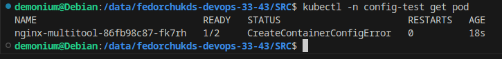
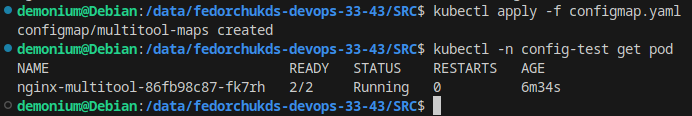
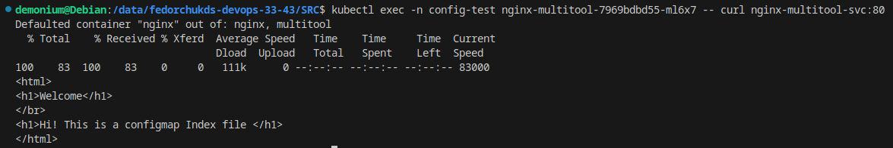
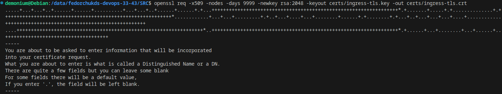
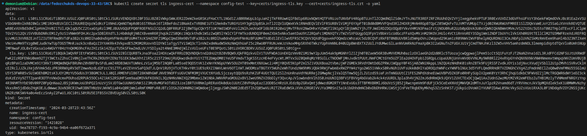
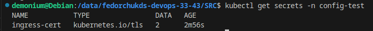
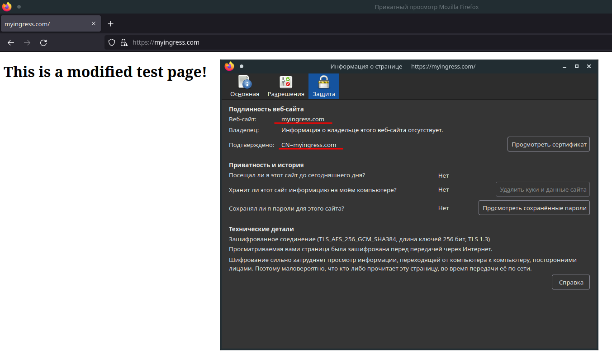
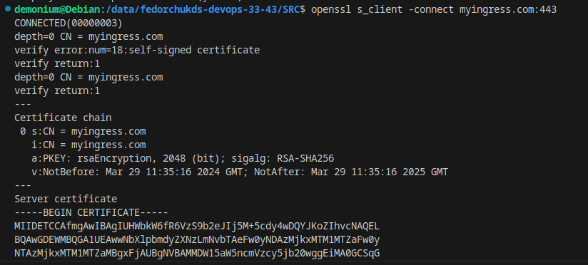

# Домашнее задание к занятию «Конфигурация приложений»

### Задание 1. Создать Deployment приложения и решить возникшую проблему с помощью ConfigMap. Добавить веб-страницу

1. Создать Deployment приложения, состоящего из контейнеров nginx и multitool.
2. Решить возникшую проблему с помощью ConfigMap.
3. Продемонстрировать, что pod стартовал и оба конейнера работают.
4. Сделать простую веб-страницу и подключить её к Nginx с помощью ConfigMap. Подключить Service и показать вывод curl или в браузере.
5. Предоставить манифесты, а также скриншоты или вывод необходимых команд.

------

### Задание 2. Создать приложение с вашей веб-страницей, доступной по HTTPS 

1. Создать Deployment приложения, состоящего из Nginx.
2. Создать собственную веб-страницу и подключить её как ConfigMap к приложению.
3. Выпустить самоподписной сертификат SSL. Создать Secret для использования сертификата.
4. Создать Ingress и необходимый Service, подключить к нему SSL в вид. Продемонстировать доступ к приложению по HTTPS. 
4. Предоставить манифесты, а также скриншоты или вывод необходимых команд.

------

### Выполнение задания 1. Создать Deployment приложения и решить возникшую проблему с помощью ConfigMap. Добавить веб-страницу

1. Пишу Deployment приложения, состоящего из контейнеров nginx и multitool.

Применяю манифест Deployment и вижу, что один из контейнеров пода не запустился:

2. Причина заключается в том, что стандартный порт, который используется в multitool уже занят, поэтому нужно использовать альтернативный порт. Этот альтернативный порт укажу в виде переменной `HTTP_PORT` в ConfigMap и укажу значение переменной равное `1180`.

3. Применю манифест ConfigMap и проверю изменилось ли состояние контейнера multitool в созданном поде:

Контейнер запустился, так как проблемная ситуация с портом контейнера была устранена.

4. Сделаю простую веб-страницу и подключу её к Nginx с помощью ConfigMap. Для этого модернизирую Deployment, добавив в него volumeMounts ссылающийся на путь по умолчанию для nginx, где находится индексная страница - /usr/share/nginx/html/, а также сошлюсь на сам ConfigMap. Подключаю Service и применяю ConfigMap.

Проверю, покажет ли nginx из контейнера пода созданную мной простую индексную страницу:

Текст индексной страницы, написанной мной в ConfigMap и текст индексной страницы из контейнера пода одинаковы, следовательно она взята именно из содержимого ConfigMap.

5. Ссылка на манифест https://github.com/osipovtema/K8s6/tree/main/SRC

   ------

### Выполнение задания 2. Создать приложение с вашей веб-страницей, доступной по HTTPS 

1. Пишу манифест Deployment приложения, состоящего из Nginx

Манифест похож на тот, что использовался в первом задании. Также используется volumeMounts, указывающий на расположение стандартной индексной страницы nginx.

2. Создаю собственную веб-страницу и подключаю её как ConfigMap к приложению. В Deployment ссылаюсь на имя, указанное в ConfigMap.

3. Выпускаю самоподписной сертификат SSL:

 Создаю Secret для использования сертификата:

Файлы сертификатов конвертирую в формат base64 и размещаю в манифесте Secret.

Проверю, действительно ли создан секрет:

Секрет создан.

4. Создаю Ingress и необходимый Service, подключаю к нему SSL. Проверю доступ к сайту по HTTPS:

Сайт открывается, текст страницы взят из ConfigMap. Сертификат сайта подключен:

5. Ссылка на манифест https://github.com/osipovtema/K8s6/tree/main/SRC
